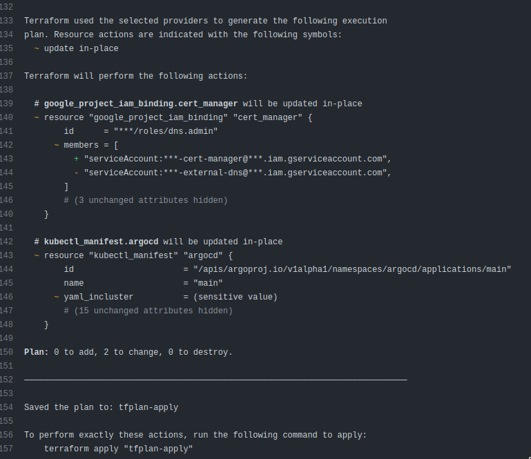

# infrastructure

> <picture>
>   <source media="(prefers-color-scheme: light)" srcset="https://github.com/Mqxx/GitHub-Markdown/blob/main/blockquotes/badge/light-theme/info.svg">
>   
> </picture><br>
> This repo is an active WIP and the configuration/structure is a subject to change

This repo holds the configuration for RPCh infrastructure such as:

- Terraform manifests
- Dockerfiles
- Helm charts
- Kubernetes manifests
- ArgoCD applications

The repository aims to:
- Automate near 100% of all resources (infrastructure, services, applications)
- Utilize industry-standard tools and practices (orchestration, containers, gitops, security)
- Provide easy-to-use configuration

## Kubernetes cluster setup

### Preparation

Make sure you have:
- A Github account with escalated permissions to set secrets.
- A GCP service account with escalated permissions to create resources. Note: please remove the escalated permissions when done with pipeline steps `day-0` and `day-1` for security reasons.
- A GCP storage bucket for storing Terraform state.
- GCP APIs enabled:
  - `compute.googleapis.com`
  - `container.googleapis.com`
  - `dns.googleapis.com`
- A new RSA keypair with no passphrase for ArgoCD to access the Github repo. The public key of this keypair has to be then uploaded to the deploy keys of the repository; the private key has to be set as a secret variable `ARGOCD_CREDENTIALS_KEY`. You can generate the keypair by running:

```shell
ssh-keygen -b 2048 -t rsa -f /tmp/id_rsa -q -N "" -C rpch-anaconda
```

### Secret variables

We try to keep as little secret variables as possible by design. For the sake of convenience, define the following secrets in your Github secrets section:

- `GOOGLE_APPLICATION_CREDENTIALS` = GCP service account credentials.
- `GOOGLE_PROJECT` = GCP project ID.
- `GOOGLE_REGION` = GCP project default region.
- `GOOGLE_BUCKET` = GCP bucket for storing Terraform state.
- `ARGOCD_CREDENTIALS_KEY` = Base64-encoded ArgoCD credentials private key from the previously generated keypair.

### Non-secret variables

For non-secret variables, simply edit/add them in the `.env` file, which gets sourced during pipeline runs, e.g.:

```dotenv
export TF_VAR_name="rpch-anaconda"
export TF_VAR_domain="rpch.tech"
export TF_VAR_argocd_repo_url="git@github.com:Rpc-h/infrastructure.git"
export TF_VAR_argocd_credentials_url="git@github.com:Rpc-h"
```

### Installation

Run the `day-0-apply` workflow in Github to install `day-0` resources such as:
- GKE Kubernetes cluster and node pools.
- IAM service accounts and bindings for the Kubernetes cluster.
- VPC networks and firewall rules for the Kubernetes cluster.

After successful completion of `day-0-apply`, run the `day-1-apply` workflow in Github to install `day-1` resources such as:
- ArgoCD helm chart and the initial ArgoCD app-of-apps.
- IAM service accounts and bindings for `day-2` applications, e.g. `cert-manager`, `external-dns`, etc.

### Uninstallation

Run the `day-1-destroy` workflow in Github to destroy `day-1`. After successful completion of `day-1-destroy`, run the `day-0-destroy` workflow in Github to destroy `day-0`. Note that some of the `day-2` cloud provider resources created by your apps, such as load balancers and DNS entries, might interfere with the current destruction of `day-1` and `day-0`. Either make sure everything in `day-2` is uninstalled cleanly, or you might have to do remove the stuck resources manually.

## Kubernetes cluster usage

### Access

1. Ensure your administrator has given enough permissions, e.g. your IAM user is assigned with `roles/container.developer` role.
2. Install Google Cloud CLI as described here: https://cloud.google.com/sdk/docs/install-sdk.
3. Acquire the cluster related info by running `gcloud container clusters list`.
4. Follow the instructions on how to access the Kubernetes cluster here: https://cloud.google.com/kubernetes-engine/docs/how-to/cluster-access-for-kubectl. Run `gcloud auth login` and follow the on-screen instructions and pick the correct Google project. Next run `gcloud  get generate 
5. Verify you're able to access the cluster and see the nodes by running: `kubectl get nodes`.

### Workflow

From this point on, developers are mostly interested in applications under `day-3` directory. This repo, among others, holds 3 important branches:
- `main`
- `staging`
- `testing`

In the current setup, there is 1:1 mapping between the branches and the Kubernetes namespaces that should be respected:
- `main` -> `production` -> you should use `rpch.tech`
- `staging` -> `staging` -> you should use `staging.rpch.tech`
- `testing` -> `testing` -> you should use `testing.rpch.tech`

For example, let's take a look at `day-3/discovery-platform/application.yaml` manifest:

```yaml
apiVersion: argoproj.io/v1alpha1
kind: Application
metadata:
  name: discovery-platform-production
  namespace: argocd
spec:
  project: default
  source:
    repoURL: https://github.com/Rpc-h/infrastructure
    targetRevision: main
    path: charts/discovery-platform
    plugin:
      env:
        - name: HELM_VALUES
          value: |
            image:
              repository: sitilge/discovery-platform
              tag: a6d518b
            envFrom:
              - type: secret
                name: discovery-platform-production
            env:
              - name: "FUNDING_SERVICE_URL"
                value: "http://funding-service.production:3010"
              - name: "PORT"
                value: "3020"
              - name: "NODE_ENV"
                value: "development"
  destination:
    server: https://kubernetes.default.svc
    namespace: production
  syncPolicy:
    automated:
      prune: true
      selfHeal: true
      allowEmpty: true
    syncOptions:
      - CreateNamespace=true
      - PruneLast=true
```

From `spec.source.targetRevision=main` and `spec.destination.namespace=production` you can deduct that `main` branch of the given `spec.source.repoURL` is mapping to a namespace called `production` in the destination cluster. From developer's point of view, the flow is, for example:
1. I create a feature branch and edit some of the `env` values above.
2. I crate a MR to `main` branch.
3. Upon successful merge, the new `env` values will be automatically synced & available in the `discovery-platform` deployment in `production` namespace.

### Applications

These are just some convenience commands for developers that might come in handy. Please see the official upstream docs of the respective applications for more info.

#### Authelia

To generate `authelia` password, run the following command:

```shell
export AUTHELIA_PASSWORD="your-password"
docker run authelia/authelia:latest authelia crypto hash generate argon2 --password ${AUTHELIA_PASSWORD}
```

#### ArgoCD

To retrieve ArgoCD password run: 

```shell
kubectl -n argocd get secrets argocd-initial-admin-secret --template {{.data.password}} | base64 -d
```

#### Sealed Secrets

Make sure you have the `kubeseal` binary installed: https://github.com/bitnami-labs/sealed-secrets. To generate a sealed secret run:

```shell
export NAMESPACE=your-namespace
export SECRET_NAME=your-secret

cat << EOF > /tmp/env
your-key=your-value
your-another-key=your-another-value
EOF

kubectl create secret generic -n $NAMESPACE $SECRET_NAME --from-env-file /tmp/env -oyaml --dry-run=client > /tmp/${SECRET_NAME}-secret.yaml
cat /tmp/${SECRET_NAME}.yaml | kubeseal --controller-namespace sealed-secrets --controller-name sealed-secrets | tee /tmp/${SECRET_NAME}-sealed-secret.yaml
```

# TODOs
- Github pipelines to cache TF providers.
- In the future, think more about keeping pipelines DRY.
- Have more complex comments for each step in a job, where required.
- Find a solution where all the following hold true at the same time:
  1) two sequential stages, e.g. `day-1` to run only after successful `day-0`
  2) second job can be triggered manually only when the first job succeeds
  3) first job produces a TF plan artifact that gets ingested by the second job
  4) trigger a workflow dispatch from non-main branch initially

# Notes

- One more reasons for having day-1: https://registry.terraform.io/providers/hashicorp/kubernetes/latest/docs#stacking-with-managed-kubernetes-cluster-resources
- did not touch any Terraform config. GCP!!!!! What is that!!!??!?!?!?!?!?!
- OH MY GOD! https://github.com/Rpc-h/infrastructure/actions/runs/4158375269/jobs/7206744448



-    #TODO - I think there is a problem with argocd-sugar plugin as it might be re-using helm values file from another apps.
     #TODO - check that